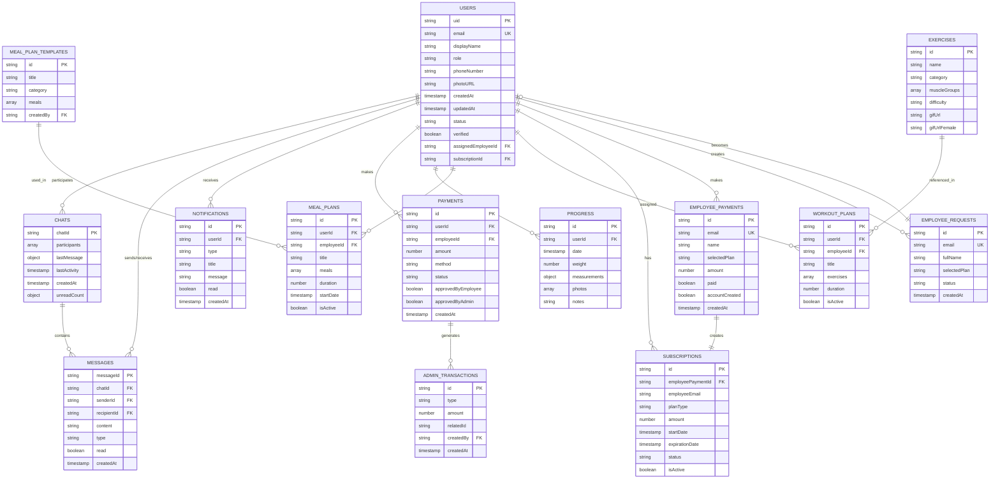
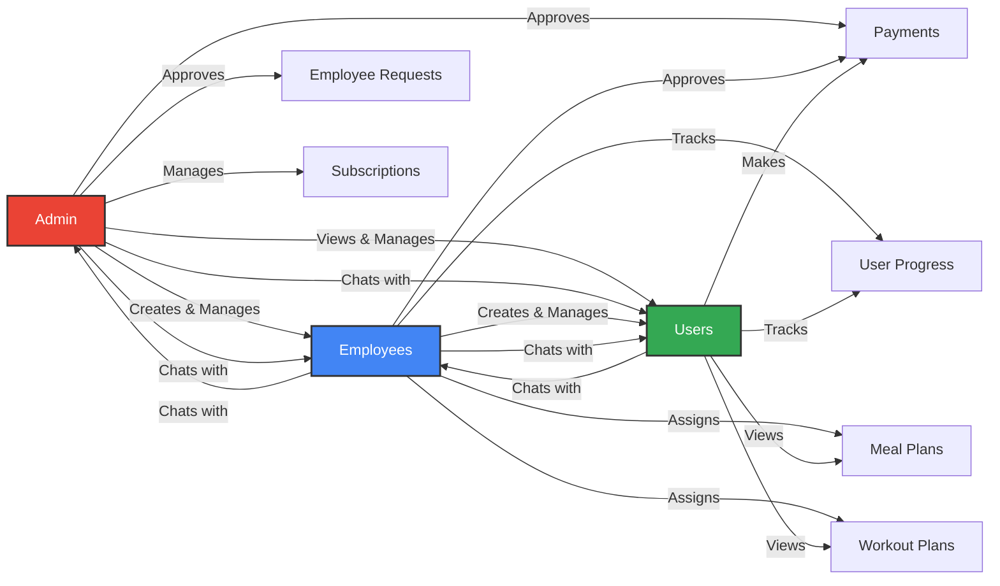
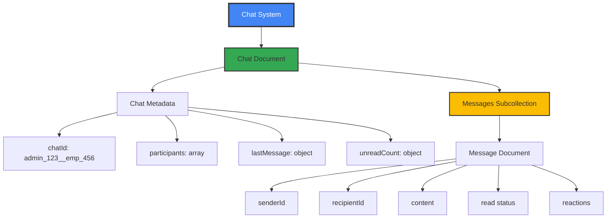
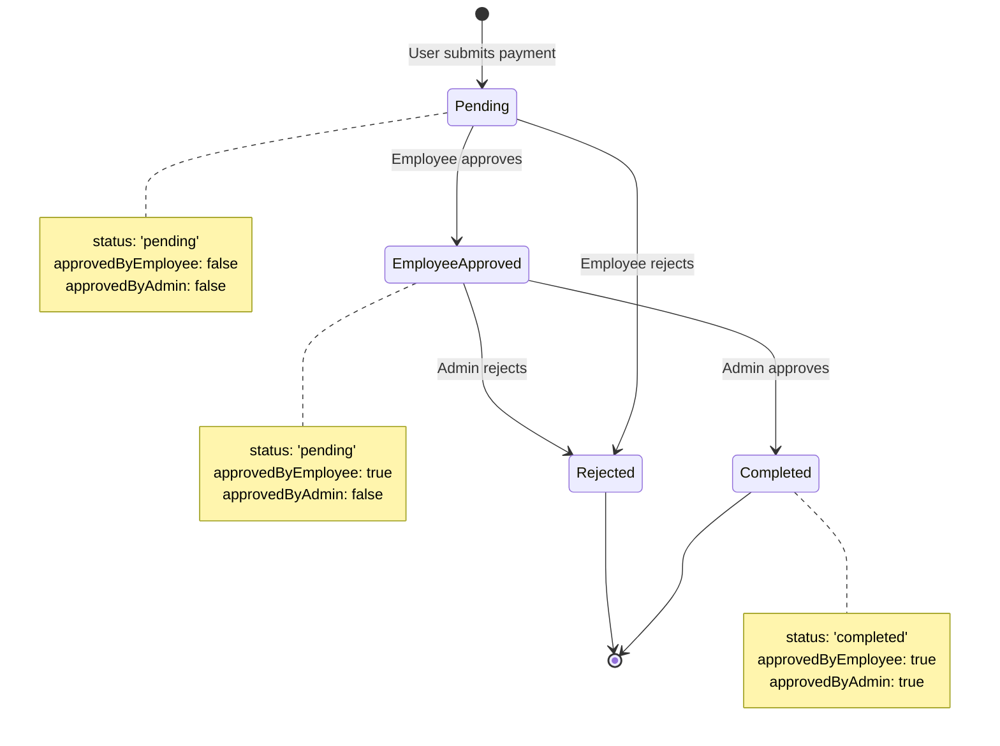
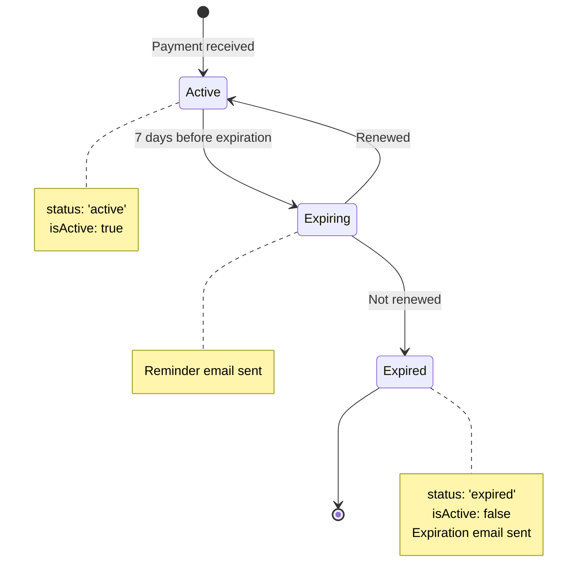
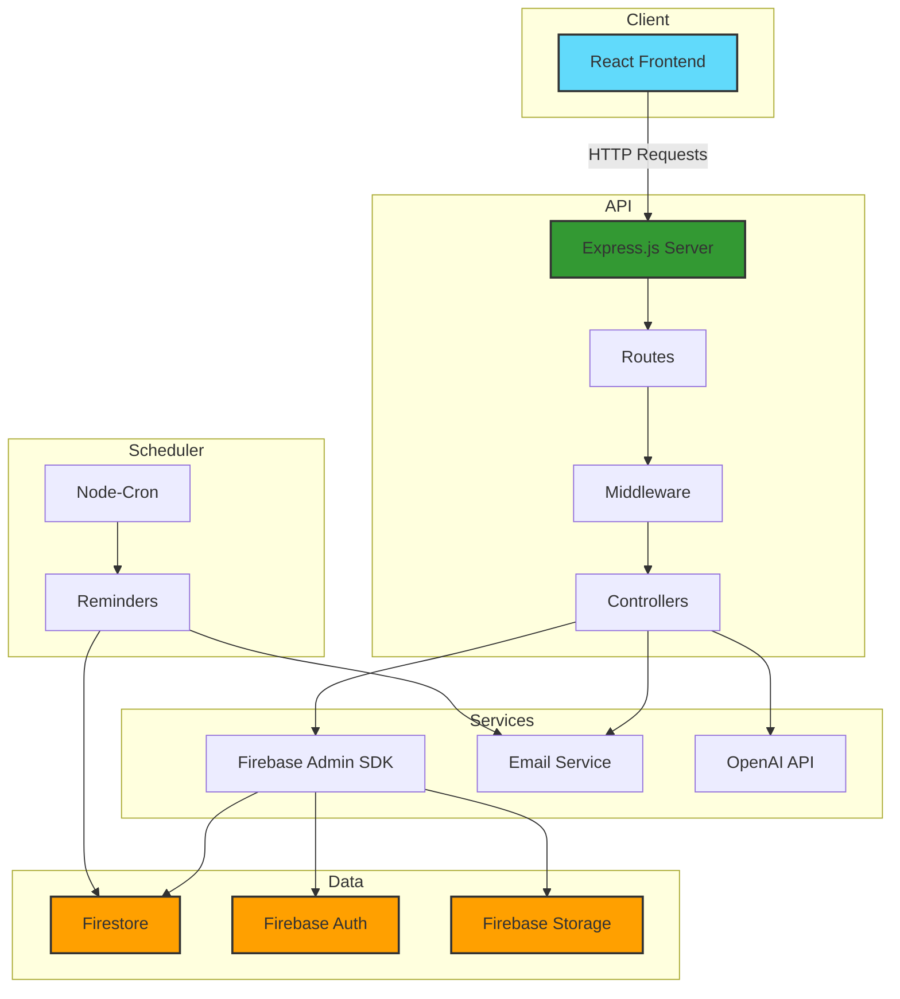
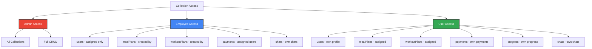

# FitFix Database Diagrams

This document contains visual database diagrams using Mermaid syntax. These diagrams can be rendered on GitHub, in documentation tools, or using Mermaid-compatible tools.

---

## Entity Relationship Diagram (ERD)



---

## Collection Hierarchy Diagram

```mermaid
graph TD
    A[Firestore Database] --> B[users Collection]
    A --> C[chats Collection]
    A --> D[messages Collection]
    A --> E[notifications Collection]
    A --> F[payments Collection]
    A --> G[employeePayments Collection]
    A --> H[subscriptions Collection]
    A --> I[employeeRequests Collection]
    A --> J[mealPlans Collection]
    A --> K[mealPlanTemplates Collection]
    A --> L[workoutPlans Collection]
    A --> M[exercises Collection]
    A --> N[adminTransactions Collection]
    
    B --> O[users/{uid}/progress Subcollection]
    
    C --> P[chats/{chatId}/messages Subcollection]
    
    style A fill:#4285f4,stroke:#333,stroke-width:3px,color:#fff
    style B fill:#34a853,stroke:#333,stroke-width:2px
    style C fill:#34a853,stroke:#333,stroke-width:2px
    style O fill:#fbbc04,stroke:#333,stroke-width:2px
    style P fill:#fbbc04,stroke:#333,stroke-width:2px
```

---

## User Role Relationships



---

## Chat System Structure



---

## Payment Flow State Diagram



---

## Subscription Lifecycle



---

## Data Flow Architecture



---

## Collection Access Patterns



---

## How to Use These Diagrams

### On GitHub
GitHub automatically renders Mermaid diagrams in markdown files. Just view this file on GitHub.

### In Documentation Tools
- **VS Code**: Install "Markdown Preview Mermaid Support" extension
- **Obsidian**: Native Mermaid support
- **Notion**: Copy Mermaid code blocks
- **Mermaid Live Editor**: https://mermaid.live/

### Export as Images
1. Go to https://mermaid.live/
2. Paste the Mermaid code
3. Export as PNG, SVG, or PDF

---

**Last Updated**: Current Implementation
**Version**: 1.0.0

